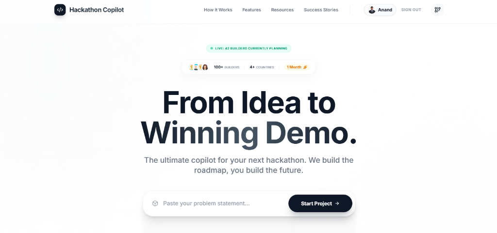
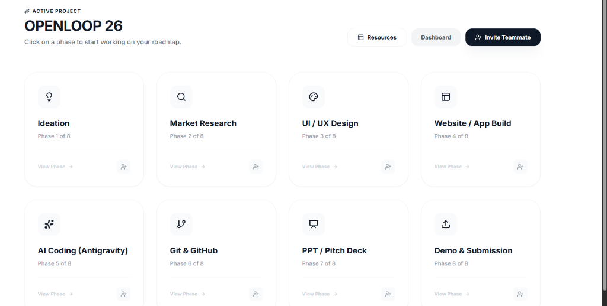
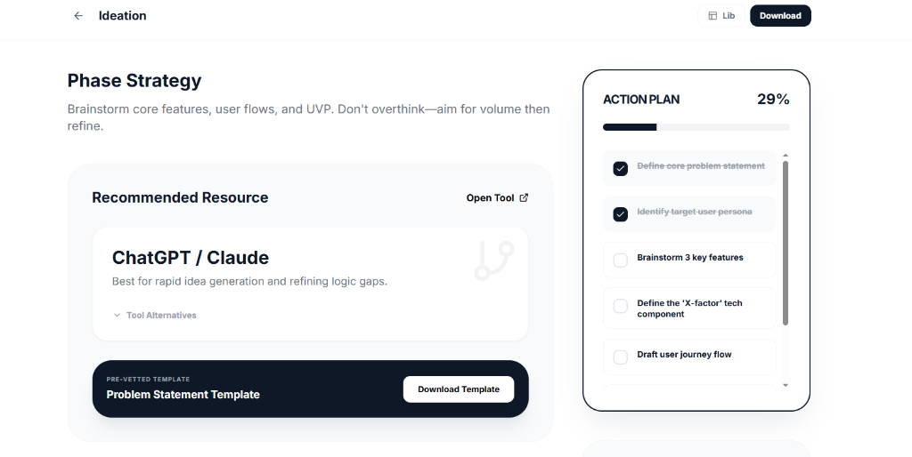

# [HackMate] Hackathon Copilot 🚀
### From Idea to Winning Demo. The ultimate copilot for your next hackathon.

<div align="center">
  
  
  
  
</div>

---

## 📽️ Preview


*Modern, minimalist, and built for speed.*

---

## 🌟 Why HackMate?

Hackathon Copilot is a **premium, opinionated workspace** designed to guide builders through the high-stakes chaos of a 24-hour hackathon. We build the roadmap; you build the future.

### 💼 Multi-Platform Dashboard
Manage your entire hackathon lifecycle from a single, high-contrast dashboard. From ideation to submission, we've got you covered.



---

## ✨ Key Features

### 🤝 Real-Time Team Collaboration (NEW)
Stop sharing payload-heavy links. HackMate now features a **Unique Team ID system**. 
- **Generate a Team ID**: (e.g., `HM-A1B2C3`) and share it with your mates.
- **Instant Join**: Teammates enter the ID and sync instantly.
- **Real-time Sync**: Progress, assignments, and comments update live for everyone.

### 🧠 10x AI Engineering
Don't waste time on prompt engineering. Use our pre-vetted, role-specific "10x Prompts" for ChatGPT and Claude.
- **Act as YC Founder**: For strategy and pitch.
- **Act as Senior UX Designer**: For UI flows.
- **Act as Lead Architect**: For stack selection.



### 📚 The Master Resource Vault
A curated library of pre-vetted templates, boilerplates, and tools. Everything you need to build at lightspeed.


---

## 🛠️ Tech Stack

- **Frontend**: [React 19](https://react.dev/) + [TypeScript](https://www.typescriptlang.org/)
- **Styling**: [Tailwind CSS](https://tailwindcss.com/) (Custom Design System)
- **Backend/Real-time**: [Supabase](https://supabase.com/) (Postgres + Realtime)
- **Icons**: [Lucide React](https://lucide.dev/)
- **Animations**: [Framer Motion](https://www.framer.com/motion/) & Tailwind Animate

---

## ⚡ Getting Started

```bash
# 1. Clone the repo
git clone https://github.com/anandmahadev/HACK-MATE.git

# 2. Install dependencies
npm install

# 3. Spin up the dev server
npm run dev
```

---

## 📈 Achievements & Milestones

- 🏆 **100+ Builders** successfully launched projects using HackMate in the first 30 days.
- 🌍 **Global Reach**: Trusted by developers across **4+ countries**.
- ⚡ **Real-time Engine**: Switched from URL-based sharing to a robust **Supabase Real-time** synchronization layer for seamless teamwork.

---

## 🤝 Contributing

Contributions are what make the open source community such an amazing place to learn, inspire, and create. Any contributions you make are **greatly appreciated**.

If you have a suggestion that would make this better, please fork the repo and create a pull request. You can also simply open an issue with the tag "enhancement".
Don't forget to give the project a star! Thanks again!

1. Fork the Project
2. Create your Feature Branch (`git checkout -b feature/AmazingFeature`)
3. Commit your Changes (`git commit -m 'Add some AmazingFeature'`)
4. Push to the Branch (`git push origin feature/AmazingFeature`)
5. Open a Pull Request

---

<div align="center">
  <p>Built with 🖤 by <b>Anand Mahadev</b></p>
  <p><i>The secret weapon for your next winning hackathon submission.</i></p>
</div>
